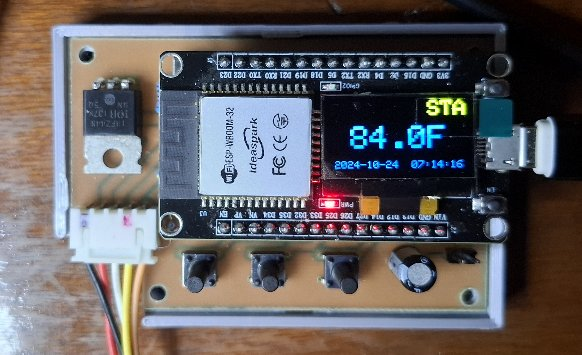
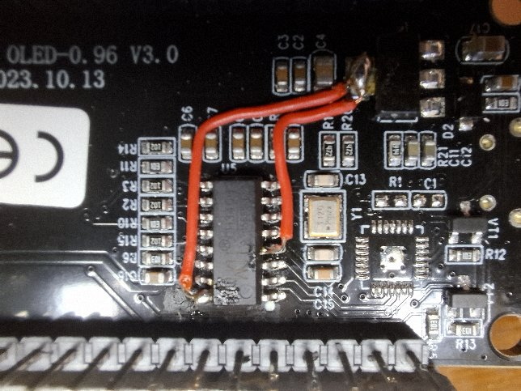

# Ideaspark ESP32 oled Problem with WiFi

You may find that if the USB Power is connected, the USB
MUST be plugged into a Windows Serial Monitor or else
the Wifi does not work on these Ideaspark, or other ESP32
boards.


In a
[project I was just completing](https://github.com/phorton1/Arduino-tempController)
based on the Ideaspark
SSD1306 ESP32 module with an oled, after testing the whole
thing with a Serial USB port, I was forced into a last minute
implementation kludge after I moved from a breadboard and
made an actual PCB with a buck converter to power the ESP32
via the 5V DIN pin from my boat's 12V electrical system
and it didn't work!



I found only one reference to the problem ... on an
[Amazon Review](https://www.amazon.com/ideaspark-Development-Integrated-Wireless-Micropython/dp/B0CN4F354N)
on a page that was selling it.

> This module has a **huge** hardware problem - Wifi does not connect unless serial
monitor is active in the debugger. This means that wifi can't be used in standalone mode.
It can be *worked around* by connecting a **330 ohm resistor from EN to GND** but
then the serial port is disabled.


Well I tried the 300 ohm resistor and it "worked" as he said, breaking
the serial port in the process.  Needing to wrap up the project,
I even *manually modified the PCB*, drilling holes and cutting
traces by hand, to put a **switch** with the 300 ohm
resistor on my now not-so-beautiful PCB.
Sheesh!!


However, I subsequently did some more testing and found that
if I powered the ESP32 via the 3.3V pin instead of the 5V DIN pin that
Wifi worked ok. This required another kludge to my PCB, but at least it
worked. That's the solution I went with for my past-due deployment
of the temperature controller.

However, that **pissed me off** *(I just bought 8 of these ESP32s)*, and
there are lots of reasons to want 5V rails in my projects, so
I decided to **really drill down** into the problem and figure out
what was going on, and **learn how to fix it**.

## Executive Summary

The basic fix is that you need to **lift the VCC pin** on the
*CH340G USB* chip on the module, and supply it with 3.3V instead
of 5V, and to also **provide 3.3V to the V3 pin** on the CH340G,
neither of which Ideaspark did whey they designed, implented, and
*SOLD a defective*, but otherwise really nice, product.
They instead powered the CH340G with 5V, which causes 5V
to be presented on several pins of the ESP32, most notably
the EN pin, which, apparently, interferes with the WiFi,
as well as just being a really bad idea, since the **ESP32
is a 3.3V device!**

[](images/ssd1306_fix_big.jpg)

After I made this fix to all 8 of my Ideaspark ESP32's,
they all succesfully connect to WiFi when powered from
VIN or by a USB charger, and they work fine in programming
mode from the Arduino IDE on my Win10 machine.


## Analyzing the Problem

I started by creating detailed schematics of both modules.
Although I could not trace a few capacitors and resistors
completely, which I think are used for the displays which
I didn't want to remove from my boards for the analysis,
I believe these are pretty darned accurate schematics.

Please see the **kicad** folder for the actual schematic
file

- [ideaspark ssd1306 schematic.jpg](images/ssd1306_schematic.jpg)
- [ideaspark st7789 schematic.jpg](images/st7789_schematic.jpg)
- [kicad file schematic](kicad/ideaspark_modules/ideaspark_modules.sch)

Note that they are not intended to be  pretty new design documents.
Instead the schematics are laid out in the actual physical arrangement
that the components appear on the modules,  This helped me to
reverse engineer the circuit.

I have also included the
[CH340G datasheet](CH340DS1-1.pdf) in this repo for
completeness.

Once I was reasonably sure I had a firm picture of the relavant
circuits.  I then moved to making a few measurements.

## Initial Measured Voltages

These are the measurements I made on an SSD1306 module.
BOOT is my name for the D0 pin on the ESP32. By now I
knew where I could find all of these signals on the board:

### USB Power (Wifi Works)

- VIN	4.7
- 3V3	3.294
- EN	3.291
- DTR	0.00
- RTS	0.00
- RX0	4.66	!
- BOOT	3.289
- CH340G VIN	4.69

### USB No Serial Monitor (Wifi Doesn't Work)

- VIN	4.7
- 3V3	3.294
- EN	4.05	!
- DTR	4.56	!
- RTS	4.62	!
- RX0	4.66	!
- BOOT	4.0		!
- CH340G VIN	4.73

### Powered by DIN (Problem)

- VIN	5.06
- 3V3	3.302
- EN	4.372	!!!!
- DTR	4.8		!
- RTS	5.0		!
- RX0	5.19 	!!!
- BOOT	4.2		!
- CH340G VIN	5.07


OK ... so now I'm thinking *"that can't be right"*.
EN, BOOT, and RX0 are ESP32 pins, and the **ESP32
is a 3.3V device**!!


## YouTube Solution

Finally, after days of searching, hours of work, I finally had a clue!
It didn't take me long to find this YouTube video from
, for which I thank
the author.

[**ESP32 Modules with CH340 USB Chips Running at 5V instead of 3.3v on Tx/Rx?**](https://www.youtube.com/watch?v=F7tIs21Ar9s)

It all comes down to this:

``` text
Lift the CH340G VCC input pin
Connect 3V3 to CH340G VCC and V3 pins
```
When I finally got the courage to do the fix, lifted the
tiny SOP-20 pins, soldered the tiny wires, on the board,
all I could say was **Yay!**.  Its seems to have fixed the problem!

You can see above how I chose to route the wires.  There
are other specific places on the boards that I could have
gotten the 3.3V, but I thought it best to make the fix obvious
on the boards by soldering directly to the 3.3V regulartor.


I then took the following measurements, which are much nicer.


### USB Power (Still Works)

- VIN	4.72
- 3V3	3.23
- EN	3.23
- DTR	0
- RTS	0
- RX0	3.23
- BOOT	3.23
- CH340G VIN

### USB No Serial Monitor (Problem Fixed !!!)

- VIN	4.7
- 3V3	3.23
- EN	3.23
- DTR	3.23
- RTS	3.23
- RX0	3.23
- BOOT	3.23
- CH340G VIN	3.23

### Powered by DIN (Problem Fixed !!)

- VIN	5.2
- 3V3	3.23
- EN	3.23
- DTR	3.23
- RTS	3.23
- RX0	3.23
- BOOT	3.23
- CH340G VIN	3.23


[](images/st7789_fix_big.jpg)


I ended up setting up a little production line and applying this fix to
all eight of my Ideaspark modules, lifting the CH340G pins on each,
cutting stripping, and tinning the tiny wires, soldering them on,
then testing each board, first with a continuity tester for shorts
and good connections, then by downloading this repo's INO to each.

- All eight boards succesfully download the program from the Arduino IDE with no problem.
- All eight boards now succesfully connect to WiFi when no Serial Monitor is running
- All eight boards now successfully connect to WiFi when plugged into a USB charger
- I tested one board (the first one) and it works fine when given 5V via the ESP32 DIN pin.

I also added a dab of **hot glue** to make sure the fragile lifted pin
wont accidentally get pushed back down and contact the 5V rail which is still
under the pin.


## Conclusion

I'm publishing this in hopes that if someone else has this issue, they can find,
understand, and fix the problem in a few hours, rather than the almost 5 days it
took me!


## Thanks

Thanks to
[**Gadget Sideload**](https://www.youtube.com/@gadgetsideload)
for helping me understand and solve this problem.


## License

This program, project, and repository is free software: you can redistribute it and/or modify
it under the terms of the GNU General Public License Version 3 as published by
the Free Software Foundation.

These materials are distributed in the hope that they will be useful,
but WITHOUT ANY WARRANTY; without even the implied warranty of
MERCHANTABILITY or FITNESS FOR ANY PARTICULAR PURPOSE.  See the
GNU General Public License for more details.

Please see [LICENSE.TXT](../LICENSE.TXT) for more information.


